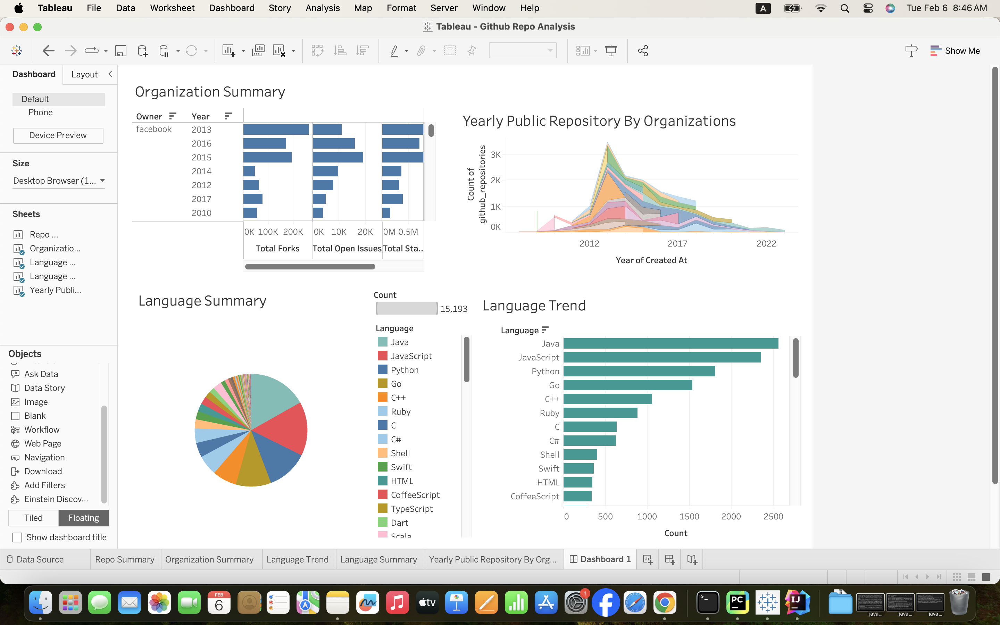
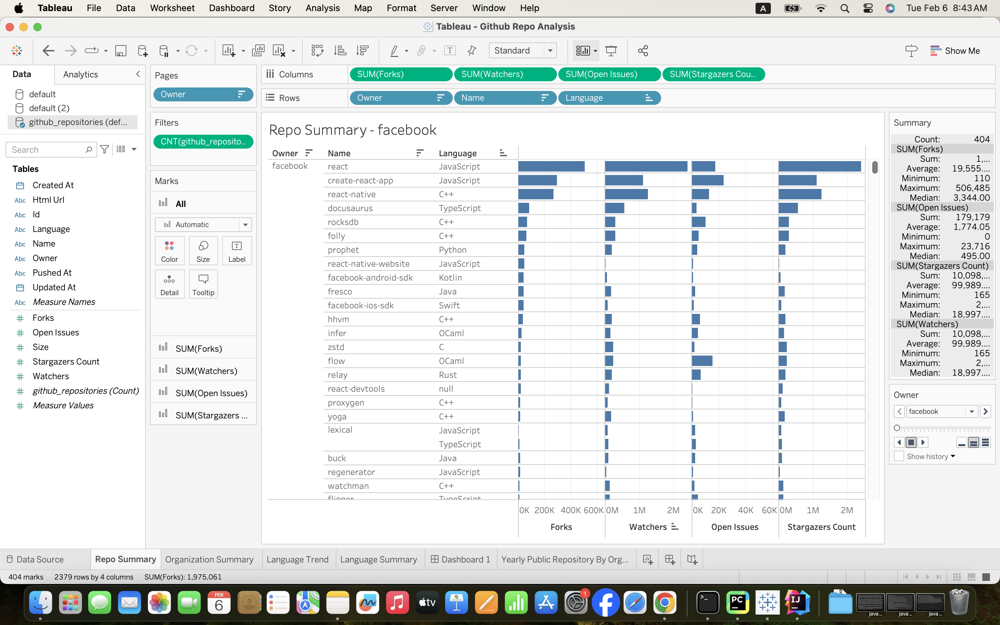
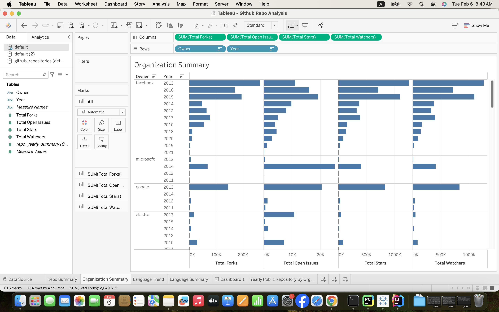
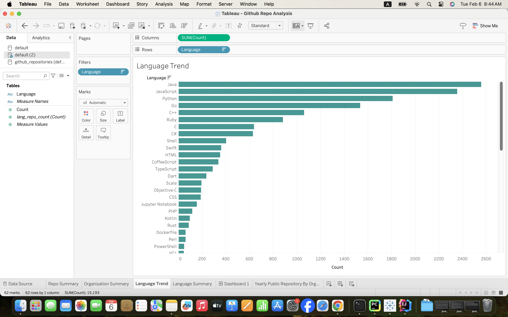

## GitHub Data Processing Project

## Overview

This project processes GitHub repository data using Apache Kafka and Apache Spark. It consists of the following three main parts:

1. **Data Ingestion**: GitHub repository data is ingested into Kafka topics.
2. **Streaming Processing**: Spark Streaming processes the data from Kafka, transforms it, and stores it in Hive tables.
3. **Analytical Processing**: Spark SQL is used to perform analytical queries on the processed data and store the results in Hive tables.

# GitHub Data Processing Project

- [Overview](#overview)
- [Part 1: Data Ingestion](#part-1-data-ingestion)
    - [Prerequisites](#prerequisites)
    - [Setup and Configuration](#setup-and-configuration)
    - [Usage](#usage)
- [Part 2: Streaming Processing](#part-2-streaming-processing)
    - [Prerequisites](#prerequisites-1)
    - [Setup and Configuration](#setup-and-configuration-1)
    - [Usage](#usage-1)
- [Part 3: Analytical Processing](#part-3-analytical-processing)
    - [Prerequisites](#prerequisites-2)
    - [Setup and Configuration](#setup-and-configuration-2)
    - [Usage](#usage-2)
- [Data Analysis](#data-analysis)
    - [Analysis 1: Repository Count by Language](#analysis-1-repository-count-by-language)
    - [Analysis 2: Repository Count by Organization](#analysis-2-repository-count-by-organization)
    - [Analysis 3: Repository Count by Year](#analysis-3-repository-count-by-year)
    - [Analysis 4: Yearly Summary for Each Organization](#analysis-4-yearly-summary-for-each-organization)
    - [Analysis 5: Top 5 Organizations by Repository Count](#analysis-5-top-5-organizations-by-repository-count)
    - [Analysis 6: Top 5 Repositories by Stars](#analysis-6-top-5-repositories-by-stars)
- [Steps to run the project](#steps-to-run-the-project)

[//]: # (    - [Start Hadoop Components]&#40;#start-hadoop-components&#41;)

[//]: # (    - [Start Zookeeper server]&#40;#start-zookeeper-server&#41;)

[//]: # (    - [Start Kafka server]&#40;#start-kafka-server&#41;)

[//]: # (    - [Start Hive Metastore]&#40;#start-hive-metastore&#41;)

[//]: # (    - [Start Spark Thrift Server]&#40;#start-spark-thrift-server&#41;)

[//]: # (    - [Run the GitHubDataProducer]&#40;#run-the-githubdataproducer&#41;)

[//]: # (    - [Run the GithubDataStreamer]&#40;#run-the-githubdatastreamer&#41;)

[//]: # (    - [Run the GithubDataAnalyzer]&#40;#run-the-githubdataanalyzer&#41;)

[//]: # (    - [Browse the Hive tables data]&#40;#browse-the-hive-tables-data&#41;)

[//]: # (    - [Run the Hive queries]&#40;#run-the-hive-queries&#41;)

[//]: # (    - [To run all the programs using Apache Airflow]&#40;#to-run-all-the-programs-using-apache-airflow&#41;)

## Part 1: Data Ingestion

### Prerequisites

- Apache Kafka

### Setup and Configuration

1. Start Zookeeper:

    ```bash
    zookeeper-server-start.sh config/zookeeper.properties
    ```

2. Start Kafka:

    ```bash
    kafka-server-start.sh config/server.properties
    ```

3. Create a Kafka topic for GitHub data:

    ```bash
    kafka-topics.sh --create --zookeeper localhost:2181 --replication-factor 1 --partitions 1 --topic github-data-topic
    ```

### Usage

1. Push GitHub repository data to the Kafka topic "github-data-topic".

---

## Part 2: Streaming Processing

### Prerequisites

- Apache Spark
- Apache Hive
- Maven (for building the project)

### Setup and Configuration

1. Start Hadoop:

    ```bash
    start-dfs.sh
    start-yarn.sh
    ```

2. Start Hive Metastore:

    ```bash
    hive --service metastore
    ```

3. Build and Run Spark Streaming Application:

    ```bash
    mvn clean package
    spark-submit --class SparkStreamingApp --master local[*] target/your-jar-file.jar
    ```

### Usage

1. Ensure data is being ingested into the Kafka topic.
2. Run the Spark Streaming application to process data from Kafka and store it in Hive tables.

---

## Part 3: Analytical Processing

### Prerequisites

- Apache Hive
- Apache Spark
- Maven (for building the project)

### Setup and Configuration

1. Ensure Hadoop, Hive, Kafka, and Spark services are running.

### Usage

1. Run Spark SQL queries to perform analytical processing on the data stored in Hive tables.


## Data Analysis
### Analysis 1: Repository Count by Language

- **Description:** Counts the number of repositories for each programming language.
- **Steps:** Extracts the "language" field from the GitHub repository data, groups by language, and counts the occurrences.

### Analysis 2: Repository Count by Organization

- **Description:** Counts the number of repositories for each organization.
- **Steps:** Extracts the "owner" field from the GitHub repository data, groups by organization, and counts the occurrences.

### Analysis 3: Repository Count by Year

- **Description:** Counts the number of repositories created each year.
- **Steps:** Extracts the year from the "createdAt" field, groups by year, and counts the occurrences.

### Analysis 4: Yearly Summary for Each Organization

- **Description:** Provides a summary for each organization, including total stars, watchers, forks, and open issues per year.
- **Steps:** Groups data by year and organization, calculates total stars, watchers, forks, and open issues.

### Analysis 5: Top 5 Organizations by Repository Count

- **Description:** Identifies the top five organizations with the highest number of repositories.
- **Steps:** Groups data by organization, counts the number of repositories, and selects the top five organizations.

### Analysis 6: Top 5 Repositories by Stars

- **Description:** Lists the top five repositories with the highest number of stars.
- **Steps:** Orders data by stars in descending order and selects the top five repositories.

These analyses aim to provide insights into repository distribution, organizational contributions, temporal trends, and top-performing entities within the GitHub dataset.


## Steps to run the project:
1. Start Hadoop Components
    ```bash
   start-all.sh
    ```
2. Start Zookeeper server:
    ```bash
   $KAFKA_HOME/bin/zookeeper-server-start.sh $KAFKA_HOME/config/zookeeper.properties
    ```
3. Start Kafka server:
    ```bash
    $KAFKA_HOME/bin/kafka-server-start.sh $KAFKA_HOME/config/server.properties
     ```
4. Start Hive Metastore:
    ```bash
    hive --service metastore
    ```
5. Start Spark Thrift Server:
    ```bash
    $SPARK_HOME/sbin/start-thriftserver.sh
    ```
6. Run the GitHubDataProducer to push the data to Kafka topic
     ```bash
     java -jar "/Users/saleh/Desktop/MIU Resources/BDT/GithubRepoAnalyzer/GitHubDataProducer/target/GitHubDataProducer-1.0-SNAPSHOT.jar"
   ```
7. Run the GithubDataStreamer to process the data from Kafka and store it in Hive tables.
    ```bash
    $SPARK_HOME/bin/spark-submit --master local[*] --deploy-mode client --class SparkStreamingApp --name spark-streamer-submit "/Users/saleh/Desktop/MIU Resources/BDT/GithubRepoAnalyzer/GithubDataStreamer/target/GithubDataStreamer-1.0-SNAPSHOT.jar
    ```
8. Run the GithubDataAnalyzer to perform analytical processing on the data stored in Hive tables.
    ```bash
    $SPARK_HOME/bin/spark-submit --master local[*] --deploy-mode client --class SparkSQLAnalysis --name spark-analyzer-submit "/Users/saleh/Desktop/MIU Resources/BDT/GithubRepoAnalyzer/GithubDataAnalyzer/target/GithubDataAnalyzer-1.0-SNAPSHOT.jar"
    ```
9. Browse the Hive tables data using the HDFS web UI:
   http://127.0.0.1:9870/explorer.html#/user/hive/warehouse
10. Run the Hive queries to perform analytical processing on the data stored in Hive tables.
    ```bash
    beeline -u jdbc:hive2://localhost:10000
    ```
11. To run all the programs using Apache Airflow:
    ```bash
    airflow webserver -p 8080
    airflow scheduler
    ```
    Browse the Airflow UI:
    http://localhost:8080/
    Trigger the DAG to run all the programs.

## Visualizations using tableau:






    

